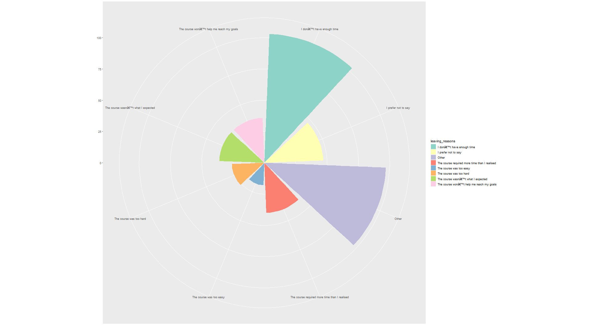

```{r setup, include=FALSE}
knitr::opts_chunk$set(echo = TRUE)
knitr::opts_knit$set(root.dir= normalizePath('..'))
```

```{r ProjectTemplate, include =FALSE}
library(ProjectTemplate)
load.project()
```

```{r EDA, include = FALSE}
source("./src/eda.R")
```

**Introduction - ** 

Massive Open Online Courses (MOOCs) are free online courses available for anyone to enroll. MOOCs have dramatically changed the way the world learns by providing an affordable and flexible way to learn new skills, help in career advancements etc. There is a very vast amount of data produced by e-learning systems and the measurement, collection, analysis and reporting of this data about learners can help a business a lot in optimizing learning experience and the environment in which it occurs  

This project is about extracting insights from learners’ data provided by an online course provider Future Learn for a cyber security course.  
 

**Business Understanding ** 

In this project we are analyzing, exploring, transforming and gathering the past information from the data and using it to improve our course for future batches based on past learning and experience. 


**Data Understanding:** 

We have data of 7 batches which was run in a span of 2 years from  2016 to 2018. 

We have 7 sets of static as well as fluid data for each batch which gives us the details about the student records, and the students’ interaction with the virtual course. There different datasets for all the seven batches are: 

1) Archetype survey response – it gives the details about the learners and their archetype, that is how they intend to use this course for. 

2) Enrolments – this gives the students’ details and information, and their enrolment details and the full participation in the course (course completion, that is purchased the upgraded course certificates). 

3) Leaving survey response – this data set gives us an idea of the learners who left the course when (the timestamp as well as the last step at which they left the course) and the reason of leaving. 

4) Question response – this dataset gives us the details of the assessment in the course. 

5) Step activity – this dataset gives us the details of the steps(topics) and if the learners visited and completed that topic (or step) 

6) Team members – this dataset gives us the knowledge of the role of the user in the course and their role in their team. 

7)  Video stats – this dataset gives us the details of the video modules in the course. It gives us the description of the video duration of the topics, the total no of views, number of people who downloaded the video and other details how people accessed these video modules. It also gives us the information about the percentage length of each video viewed. It provides us with the information of the devices which were used to access the videos and the information about the views from all the continents.  

8) Weekly sentiment survey – this dataset gives the details about the feedback from the learners for the weekly modules. 

We have similar types of files for all the seven batches. The number 1,2,3...and so on in the file names represent the batch number. 

The data for enrolments, question response and step activity are provided for all the seven batches. The archetype survey response data and the data set containing the details of the video stats is not provided for batch number 1 and 2, but is available for all the other batches. The leaving survey response data is provided only for the batches 4,5,6 & 7. The data for team members is provided for all the batches except for the first batch. The weekly sentiment survey dataset is only available for the batches 5, 6 and 7 where batch 5 contains the response from just one learner. 

After examining the basic properties, summary and the details of the data we discovered that a lot of the entries in the data set are “Unknown” or have missing values.  

So, we have done our analysis and visualizations on the data that is provided to us excluding the unknown values (that constitutes a significant amount of data). So, this analysis may or may not give exact results and the insights. 

**Business Objective ** 

- Our first objective for this project is targeting the serious learners, and audience and increasing the retention of the student for the course. 


**Data Description ** 

Here for this analysis, we are using the enrolments dataset and the archetype dataset from all the seven batches to see what kind of learners are interested in the course and how well these insights can be used to achieve our goal. We have used the leaving response survey data set from all the seven batches to analyze what is the most common reason for people leaving the course. 


**Data Preparation: ** 

The data from the same type of dataset from all the seven batches are merged to get an overview of the kind of learners and for other analysis of the course. 
Here we have merged the enrolments dataset of all the 7 batches to get an overall view of the trend and the characteristics of the learners. 

The enrolment dataset and the archetype dataset from all the batches are also merged to get an idea about the learners that how they intend to use this course for.  

Here in these datasets, we can see that the data is not very consistent and we have a lot of missing values and some of the entries as “Unknown”, so we have done the analysis leaving the unknown values. In 

Again, in the enrolment's dataset, we have country columns and the detected country columns, there are a lot of missing values in the country column, so we have carried out our analysis on the basis of detected country column. Moreover in the same dataset we have roles defined as Learners and Organisational admin. We have done our analysis for all the learners (the organisation admin entries were excluded when we excluded the unknown values from different variables)

**Evaluation/ Data Analysis:**  

Here we are checking the trend of the learners who enroll in the course and the ones who fully participated in the course. 

Fig 1.  this gives the trend of all the learners from all the 7 batches who enrolled for the course as well as who completed the course. 


```{r, echo = FALSE,out.width="100%", fig.cap="Trend of learners who enrolled vs who completed across all batches"}
# knitr::include_graphics("C:/Users/Payal/Desktop/Future_Learn_EDA_DM/graphs/enrol_vs_comp_plot.png")
plot(enrol_vs_comp_plot)
```

Here we can see highest number of learners enrolling in the first batch and then the no. Of participants decreases significantly.  We can see that there is an increase in the number of participants for the 4th batch but after that it has shown a decreasing trend. We observe that there is significant difference in the number of learners who have enrolled and the ones who have completed the course. This can be analyzed further with leaving survey response dataset which contains the reason for participants leaving the course. 


Fig 2. gives a visual analysis of the leaving response by the learners. 


```{r, echo = FALSE,out.width="100%", fig.width = 21, fig.height=9, fig.cap="Leaving response of the learners"}
# 
plot(leaving_reason_plot)
```


This shows that most of the learners who left the course have mentioned the reason of not having enough time. The reason about course requiring more time than expected is also chosen by a lot of learners, which depicts the same reason of learners struggling with time. Here we can further check what kind of learneres are involved and how can this issue be resolved.

Now, here fig 3 shows the Combined overview of learners who enrolled for the course and the ones who fully participated in the program (purchased the upgraded course certificates). 
For this we will be using our merged enrolments dataset from all the seven batches.


```{r, echo = FALSE,out.width="100%", fig.height = 9, fig.width = 16, fig.cap="Enrolled and fully participated over different variables"}
# knitr::include_graphics("C:/Users/Payal/Desktop/Future_Learn_EDA_DM/graphs/completed_vs_enrolled.png")
plot(completed_vs_enrolled)
```

Now this graph, fig 3 shows the different characteristics of the learners who enrolled and the learners who fully participated in the course, i.e., they completed the course and purchased the course certificate.


Here when we see the employment area of the learners, we see that people from various domains have enrolled for the course but we can see that most of the learners are from IT and Information Services background and thus they are much interested in the course. The second dominating employment area is Teaching and education. May be there is a possibility that learners from these areas are pursuing this course for career advancements in their field. The line graph represents the learners who have fully participated (completed the course, i.e, that is purchased the upgraded course certificates). Here we observe that they mostly follow the same trend as enrolments in this case. We notice that from the employment area, Recruitment and PR, none of the learners have completed the course. This can be further checked and can be a future scope of this project to see why this particular category doesn’t have any learner who completed the course. 

The course offered, that is, Cyber Security (Cyber Security: Safety at home, online, in Life) teaches about the cyber threats and the security measures to be followed and is kind of related to the IT domain-based course, so we can see that most of the learners are from that area and thus are our target audience. Now, when we are aiming the other group of learners, despite the course (as seen from the modules and the topics) explains about the basic cyber safety rules that can be implemented in daily lives, people from other backgrounds tend to be skeptical about the course thinking that it might be on the very technical side and thus not enrolling for the same. In this case we can focus on tailoring our course in a way that it's understandable and approachable from learners from varied backgrounds. One way can be introducing this course in two levels as 1) Beginners and 2) Advanced. With this there is a possibility that learners from different background will now be tempted and will look forward to joining the Beginner level of the course to get familiar with the topic and if they build a foundation, they will be interested in enrolling for the next level of the course to get the knowledge of the topic on whole. This can increase the reach and customer base for our business. There will be a tradeoff with effort and timing but it can be compensated with the profit made. 


When we see the higher education level, we see that most of the learners who enrolled, have completed their university degree. They are our serious learners and our target audience. The approach that we used previously to target learners from various other domains can be beneficial here as well because then learners from any educational level background will be comfortable in enrolling for the course. Here, we can observe the learners who are on apprenticeship never fully participated for the program.  


Now when we are analyzing the age range, we can see that most of the learners are from the age range 26-35. The second and third highest number of learners are from the age range 18-25 and more than 65 years respectively. Here we see that learners who are in the age range of more than 65 years tend to fully participate in the course the most as compared to others. Now, simultaneously if we see the employment status, we can see the highest number of learners enrolled are working full time and then the next highest number of learners are from the retired category. Here again we observe that learners from retired category tend to have fully participated in the course the highest as compared to others. This analysis shows that learners who are retired (generally they belong in the age range >65 years) tend to fully participate in the course (i.e., compete the course and purchase the upgraded certificate). 
It might be possible that they have some extra free time as compared to those who are working or otherwise. 

Another possible reason for the learners from the retired category and the age group of more than 65 years of age to stay through the course and fully participate in it, can have to do something with what the course offers. Here we can see that the course is for cyber security (safety at home, online, in Life), which is something that everyone wants to have knowledge of.  In a very general scenario, a very significant number of people who are in the age group above 65 years or so are not very well versed with technology and its applications and they are trying to be in sync with the day-to-day applications of the technology and internet in a safe and secure manner. In today’s world everything is connected via internet and everyone at some point of time has to use it in daily life applications at some place. So, the senior citizens who are starting to use the technology and the online smart applications in their daily lives may be wanting to learn about the privacy issues and keeping themselves safe from cyber fraud and crime. 

Talking about the gender we can’t say it is a very significant factor in analysis as the number of male and female catch up to each other. We even see that most of the learners belong to these two categories and very few learners have mentioned their gender as others or non-binary.

**Analysing the Archetype of the learners to see how people intend to use this course for **

For this analysis we are using our merged data from enrolment and archetype dataset.Although we don't have archetype for batch 1 and batch 2, but here we are joining(left join) all the available data that we have and then producing a broad overview of our analysis.


```{r, echo = FALSE,out.width="100%", fig.cap="Archetype of the learners enrolled"}
# knitr::include_graphics("C:/Users/Payal/Desktop/Future_Learn_EDA_DM/graphs/archetype_enrolled_Vs_completed.png")
plot(arche_plot)
```


So now when we see the archetype of the learners, we see that the highest number of learners who enrolled for the course are from the category,  vitalisers, explorers and advancers. Advancers rank 3rd in the enrolment but their rate of full participation in the course is highest. They are our most serious learners and they intend to use this course to pick up additional work-related skills. 

Explorers are considering a career change and are using this course to evaluate their options. The number of enrolments for them is high too, but they tend to full participate in the course less than the advancers. Vitalisers enrolled the most but their rate of completion is less than the advancers. They have joined this course as hobby just like hobbyists. 

Here it can be interpreted that learners from maybe IT background who rank the most in employment area, want advancement in the same career and thus tend fully participate in the course by purchasing the upgraded course certification.

Overall if we see these data and their analysis, it tells us that usually the learners who are from IT and Information services domain tends to join the course more, again the people who are in the age range of 26-35 and works full time and have completed the university degree are our most enrolled learners but the rate of fully participation is kind of on the lower side.

Moreover, earlier from fig 2 - the leaving response survey, we even saw that learner who left the course and did not fully participate gave the feedback of not having enough time and again we also analyzed that mostly the learners belong to the employment status of working full time and thus face difficulties in managing time for the course. Here one solution to retain the learners from this category can be to expand the duration of the course so that learners can spend a little less time each week and thus end up completing the course at their convenience and not leaving the course mid-way due to time crunch and thus we can reduce the student drop out rate from our course.


We will now focus on analysing the weekly response or the feedback from the learners to get an idea of how the learners have responded to our course.
For this we will be using the merged file from all the seven batches of the weekly sentiment survey response data set. 

The exploratory textual analysis of the weekly sentiment's dataset is done by word cloud. It provides an excellent way to analyze the text data through visualization and helps to find important words that can help in extracting insights from the data through which we can communicate the most salient points in the reporting. For this a vector is created containing only the text and then the text data is loaded as a corpus. Then the data was cleaned by removing the special characters, numbers or punctuation from the text, as well as removing common stop words and stripping the white spaces. Then a data frame is created containing each word in the first column and their frequency in the second column which was used to create our desired visualization.


```{r, echo = FALSE, out.width="100%", fig.height=5, fig.width=5 ,fig.cap="Weekly feedback about the course", warning=FALSE}
#
wordcloud(words = df$word, freq = df$freq, min.freq = 1, max.words=200, random.order=FALSE, rot.per=0.35, colors=brewer.pal(8, "Dark2") )
```

#```{r wordcloud, echo = FALSE, out.width="100%", fig.height=5, fig.width=5 ,fig.cap="Weekly feedback about the course", warning=FALSE}
#weeklysentiment_analysis <- wordcloud2(data=df ,size=1.6, color='random-dark')
#saveWidget(weeklysentiment_analysis, "tmp.html", selfcontained = F)
#webshot("tmp.html", "weeklysentiment_analysis.png", delay = 10, vwidth = 2000, vheight = 2000)
#

#```


Now, when we see the weekly sentiment of the learners, in fig 5 , we mostly have positive responses.
So we can say that learners who fully participated in the course , found the the contents positive and helpful and are happy with the course. As analysed above we can infer that, as we see most of the learners are from IT and Information services so there is a possibility that they will feel familiar with the course and are satisfied with the content. Here we can try streamlining our course in a way that it would be helpful for learners from different backgrounds and domains to increase our reach to diverse fields of learners and adequately meet their requirements and expectations from the course as well.

Now we can also target our audience from the countries, where the learners enrolled the most.

We can analyse this on the basis of continents and further from the countries.

For carrying out analysis for the continents for maximum number of course videos watched by the learners, which in a way shows the maximum participation from the continents, we used the merged video_stats data set from all the batches and calculated the column mean of view percentage from every continent column. This data was then taken into consideration.

```{r, echo = FALSE,out.width="100%", fig.cap="Learners from all the continents"}
# knitr::include_graphics("C:/Users/Payal/Desktop/Future_Learn_EDA_DM/graphs/continent_plot.png")
plot(continent_plot)
```

Here we observe that view percentage from all the continents rank in the order from highest to lowest starting with Europe, Asia, North America, Africa,Oceania and South America. We see that we have no views from the Antarctica. This is because we know that Antarctica is the only continent with no permanent human habitation. 

Now we will check the countries from where most of the learners enrolled for the course from the all_enrolments dataset (here as discussed earlier we will consider the detected country column)


```{r, echo = FALSE,out.width="100%", fig.height=9, fig.width=16, fig.cap="Learners from the countries across the world"}
# knitr::include_graphics("C:/Users/Payal/Desktop/Future_Learn_EDA_DM/graphs/countrywise_enrolments.png")
plot(countrywise_enrolments)
```


Here we see that the enrolments from the top 10 countries follow the trend of the learners enrolled from respective continents. This tells us that our analysis is reliable.
Here for example we see, Great Britain has the highest number of enrolments followed by India and the US which belongs to the top 3 continents ranked.

Here for concentrating on capturing more learners , we analyse which part of the world attracts most of the learners and we will try to strengthen the customer base in those areas more, plus try on tailoring the course for the area from where the response is not satisfactory to draw learners from those areas as well.

Fig 7 shows the enrolments from top 9 countries. We also observe that the top 12 countries constitute the maximum number of learners and the trend of fully participation in the course is kind of the same. So, we will try aiming the learners from those countries so that we don't loose our customer base. 

---

Now again for any online course provider, one of the most important criteria is to keep strengthening its online platform and making it more user friendly.

**Business Objective ** 

- We want to focus on optimizing the user experience and learning environment and enhancing the learning experience 


**Data Description ** 

Here for this analysis, we are using the merged video stats dataset from all the seven batches to see what kind of devices people prefer most for watching the course videos. 


**Data Preparation: ** 


From the merged video stats dataset, the column mean for each device column (desktop,mobile, tablet,tv and console) is calculated and taken into consideration to get an idea of what kind of devices people are using mostly for watching the content


**Evaluation/ Data Analysis:**  

Now, online courses are highly dependent on how friendly the user interface is for accessing the course and the materials. Here we will analyse the types of devices use most for streaming the content.

Fig 8. gives the number of devices used for watching the video modules of the course 


```{r, echo = FALSE,out.width="100%", fig.cap="Devices Used"}
# knitr::include_graphics("C:/Users/Payal/Desktop/Future_Learn_EDA_DM/graphs/devices_used_plot1.png")
plot(devices_used_plot1)
```


Here we see that most of the learners prefer watching the content on desktop than on any other device. So the interface of the site must be maintained for the desktop version and time to time upgradations should be done. We can optimize the User Interface for the mobile and tablet devices as well, so that learners can access the content easily at anytime or anyplace (as mobiles and tablets are handy ) and thus there are chances that we may see an increase in the rate of learners who can fully participate. Because if they can access the course at ease of their hand at any point of time then there is a possibility that they will tend finish the course (as stated earlier learners complained that they don't fully participate in the course and leave it midway as they don't have enough time). So, if its handy, the learners might not feel obligated to access the course from their study/work space, rather there are chances that they will tend to watch at any point of time as it will be accessible easily. This will upgrade and provide a better learning platform.

Here we can see , almost no one use the console (very negligible amount) or TV device to access the course. But keeping in mind that the data is from 3 years ago, and now a days a lot of people use smart TV , so keeping the future scope in mind, the company can focus on making the UI of TV device user friendly too. 


## Final Recommendations and Conclusion :

We observe that most of the details about the learners enrolled are unknown. There is a possibility that learners don't provide their details because of some privacy issues or lack of knowledge about how their data will be used. Here the course provider should put put in place the clear ethical policies and code of practices about how the student data will be used in analytics. This policies should address student privacy, security of data and the consent.
We can focus on students from a particular background...so and so..provide a gist of conclusion from both recommendations


